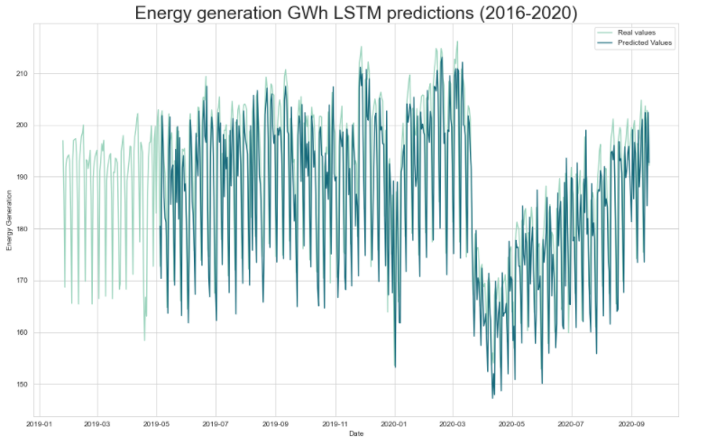

# Energy generation and capacity forecasting

Energy generation and capacity forecast as Flask microservice.

## Model predictions

### Energy Generation


### Energy capacity


### Build Docker image

```
docker build -t lstm-api . 
```
#### Host

```
 docker run -d -p 6600:6600 --name lstm-api lstm-api
```

## Data
http://www.upme.gov.co/Reports/Default.aspx?ReportPath=/SIEL+UPME/Indicadores/Indicadores+Oferta&ViewMode=Detail
